<style type="text/css">
.small-code pre code {
font-size: 0.9em;
}
.footer {
    color: black; background: #E8E8E8;
    position: fixed; top: 90%;
    text-align:center; width:100%;
}
</style>

Causality
========================================================
author: Jim Savage


Causality: motivation
========================================================

We want to draw _causal inference_ from both _experiments_ and
_observational data_
- Causal: how much do I expect $Y$ to change if I vary $X$?
- Inference: How unsure should I be of my findings? 
- Experiments: where we can learn about impact of varying $X$ by, 
er, varying $X$ (RCTs, A/B testing, etc)
- Observational data: where no deliberate experiment has been 
run (surveys, economic data, sales data, etc.)

Causality: meta-motivation
========================================================

- What do data scientists do? 
- What are the easiest things to automate?
- How do data scientists inform strategy?
- My claim is that the last thing data scientists will do is causal research.


Sorts of problems involving causality
========================================================

### No problems with inference

- Analyse results of an experiment (average treatment effects)
- Infer for population based on an experiment on a biased subset (MrP)
- Advise on set-up of A/B tests/randomized control trials
- Use experimental results to rank customers on potential uplift

Sorts of problems involving causality 2
========================================================

### Group differences involving selection-into-treatment

- Do university graduates earn more?
  - Were graduates always going to earn more? 
- School choice, teacher effects, impacts of laws etc. 
  - Pushy parents more likely to send children to "good" schools. 
- Do customers you (passively) market to have a higher probability of buying?
  - Customers already looking!


Sorts of problems involving causality 3
========================================================

### Problems involving endogenous treatment

Endogenous = caused by

- Price vs sales
  - When sales increase, pressure on price is to increase. 
- Basically all finance/macroeconomics
  - An increase in inflation leads RBA board to increase rates
  - An increase in economic activity pushes stock prices higher **and** interest rates higher


Sorts of problems involving causality 4
========================================================

### Endogenous treatment? 

- Marketing uplift
  - Does ad-buy work? Media buyers' decisions and ad spot prices reflect possible uplift for an advertisement. 
  - Qualitative impact? Do changes to your website/call scripts/customer service drive changes in sales?

The issues here come from the fact that managers are intelligent, and do their best for the business. 


Sorts of problems involving causality 5
========================================================

### Competitive focus

- How will your competitors react to your entry/product offering strategies? 
  - Can be difficult, but quite possible; often cost of making assumptions is greater than benefit.
- How will competitors react to your pricing?
  - Much easier, but still difficult. Need a good understanding of causality!


Class discussion
========================================================
  
I want 5 causal problems from your workplace before we can move on.


Why does this stump data scientists? 
========================================================

Looks similar to a predictive problem, but is not. 

### More data? 
- In prediction, more data = better predictions
- In causality, with wrong model, more data = worse estimate

### Out of sample prediction? 
- This is what we do for validation in prediction
- Causal models could have almost no predictive power and still be wonderful. 

### Automatable? 
- No

Outline for today
========================================================

1. Rubin Causal Model (RCM): Now - 10.30
2. Why use Bayesian techniques? 10.45 - 11.15
3. Estimating causal effects using regularized linear models. Bad controls/moderators. Techniques to capture non-linearity. 11.30 - 12.30
4. Lunch 12.30 - 1.30
5. Dealing with unobserved confounders that are fixed at a level of the hierarchy. 1.30-2.30
6. Using natural experiments/instrumental variables to control for unobserved confounders. 2.45 - 3.30
7. An introduction to using machine learning for causal effects. 3.45 - 4.30 (only if we have time)


Terminology
========================================================

### Treatment/Dose
- The thing you want to change: price, ad-spot, medicine, policy, etc. 

### Outcome
- The thing you care about (sales, profits, health, unemployment, etc.)

### Counterfactual
- The state of the world that we never see, where only the treatment has changed. 

### Confounders
- Variables that result in correlation not equalling causation.

Terminology
========================================================
### Controls
- Confounders that we observe/measure

### Endogenous variables
- Variables that are caused by other variables in the system (both observed and unobserved)

### Exogenous variables
- Variables that are not caused (or are very loosely caused) by other variables in the systemf

Experimental vs observational data
========================================================

### Experimental data = easy inference
- We have control over the treatment, and know how it was used. 
- Ideally, we have control over the procedures used in the experiment

### Observational data = hard inference
- We have no input into the data creation.
- Still want to draw inference. 


What is causality? 
========================================================

### The potential outcomes framework

Interested in causal relationship on $Y$ from change in treatment from $T1$ to $T2$? 

The treatment is administered at some time $t$ and both oucomes are measured at some time after the treatment $t+ s$

- Call $Y_{T1}$ the outcome under $T1$
- Call $Y_{T2}$ the outcome under $T2$

The **Treatment effect** is $Y_{T2}$ - $Y_{T1}$. 

This is called **Rubin Causality**, or **The potential outcomes framework**. You can think of it as the difference between parallel universes, where only the treatment has changed. 

What is causality? 
========================================================


| Individual| Y_T1| Y_T2| Individual treatment effect|
|----------:|----:|----:|---------------------------:|
|          1|    3|    6|                           3|
|          2|    5|    5|                           0|
|          3|    5|    6|                           1|
|          4|    3|    2|                          -1|
|          5|    7|    8|                           1|


What is causality? 
========================================================

Things to note: 
- This is a theoretical model! We can't observe both treated and 
untreated states of the world
- Only the treatment _and anything the treatment affects_ has changed
- Not all people have the same treatment effect

Are these effects free of luck polution? A great philosophical question. 

The fundamental problem of causal inference
========================================================

### The potential outcomes framework
The problem is that we observe either $Y_{t1}$ *or* $Y_{t2}$. 


| Individual| Y_t1| Y_t2|
|----------:|----:|----:|
|          1|   NA|    6|
|          2|   NA|    5|
|          3|    5|   NA|
|          4|    3|   NA|
|          5|    7|   NA|

Why can't I just predict the counterfactual?
========================================================

- If the underlying structure that causes the treatment is correlation with the variables in your model, your predictions will be biased. 
  - University and income
- Sometimes you can! 
  - So long as there are no big unobserved confounders. 

Average treatment effects (ATE)
========================================================


| Individual| Y_T1| Y_T2| Individual treatment effect|
|----------:|----:|----:|---------------------------:|
|          1|    3|    6|                           3|
|          2|    5|    5|                           0|
|          3|    5|    6|                           1|
|          4|    3|    2|                          -1|
|          5|    7|    8|                           1|

Average treatment effects is the average of `individual treatment effects`. 


```r
mean(TEs$`Individual treatment effect`)
```

```
[1] 0.8
```


Average treatment effects (ATE)
========================================================

Is this what we always want to estimate? 


Average treatment effects (ATE)
========================================================

- Tells us the average of treatment effects across a broad population
- We might be interested in a much narrower population, or a marginal population

For example: the ATE of a blood-pressure medication would include the
treatment effects on people with healthy blood pressure (treatment effect
might be much smaller). But we want to know the treatment effect for
the relevant population (those with high blood pressure)

Average treatment effects on the treated (ATET)
========================================================
class: small-code 


| Individual| Y_T1| Y_T2| Individual treatment effect| Treated?|
|----------:|----:|----:|---------------------------:|--------:|
|          1|    3|    6|                           3|        1|
|          2|    5|    5|                           0|        1|
|          3|    5|    6|                           1|        0|
|          4|    3|    2|                          -1|        0|
|          5|    7|    8|                           1|        0|

ATET does what the can says

```r
mean(TEs2$`Individual treatment effect`[TEs2$`Treated?`==1])
```

```
[1] 1.5
```

Within-strata/Group treatment effects
========================================================
class: small-code 

Often it can be helpful to calculate treatment effects within groups


| Individual| Y_T1| Y_T2| Individual treatment effect|Group |
|----------:|----:|----:|---------------------------:|:-----|
|          1|    3|    6|                           3|a     |
|          2|    5|    5|                           0|b     |
|          3|    5|    6|                           1|a     |
|          4|    3|    2|                          -1|b     |
|          5|    7|    8|                           1|a     |


```r
TEs2 %>% group_by(Group) %>% summarise(GATE = mean(`Individual treatment effect`))
```

```
# A tibble: 2 x 2
  Group      GATE
  <chr>     <dbl>
1     a  1.666667
2     b -0.500000
```


Local or Marginal ATE (LATE)
========================================================
class: small-code 

- Often, we are interested in knowing what the treatment effect
would be on a group of people who are encouraged to accept the treatment. 
- This is most common when we can't force someone to adhere to a treatment, 
but they can be encouraged. 

In this case, we can divide population into: 
- *Always takers*
- *Never takers*
- *Sometimes takers*


Local or Marginal ATE (LATE)
========================================================
class: small-code 


| Individual| Y_T1| Y_T2| TE| Sometimes taker|
|----------:|----:|----:|--:|---------------:|
|          1|    3|    6|  3|               0|
|          2|    5|    5|  0|               1|
|          3|    5|    6|  1|               1|
|          4|    3|    2| -1|               0|
|          5|    7|    8|  1|               1|


```r
TEs2 %>% filter(`Sometimes taker`==1) %>% summarise(mean(TE))
```

```
   mean(TE)
1 0.6666667
```

The treatment assignment mechanism
========================================================

The Rubin Causal Model is completed by the `treatment assignment mechanism`. 

$$
p(T\, |\, X, Y_{T1}, Y_{T2})
$$

Which simply asks _does the probability of receiving the treatment depend on
the known characteristics of each unit, or the treatment effect itself? 

If 

$$
p(T\, |\, X, Y_{T1}, Y_{T2}) = p(T\, |\, X)
$$

Then the model is said to be _unconfounded_. 


The treatment assignment mechanism
========================================================

### Where is this useful?

- Perhaps we want to run an experiment, but it's costly to run
and there's little point in running on those who aren't the tarket market. 
- Perhaps we could run an experiment where some groups are more likely to 
receive the treatment than others. 
- If we condition the probability of receiving the treatment on
known covariates, we can still do inference. 

Quick break
========================================================

## Coffee!


Some statistical background: random variables
========================================================

A variable is a **random variable** if its value is not 
controlled/deterministic. It is subject to chance. 

We think about the following as random variables: 

- Outcomes
- Parameters
- Latent Variables

A good heuristic: 

**If you don't know the value of something out-of-sample, treat 
it as a random variable**


Some statistical background: Probability density functions
========================================================

A probability density function tells us the relative probability
of observing certain values of a random variable. 

- We denote the density of random variable $X$ with $p(X)$
- $p()$ is *overloaded*, meaning $p(X)$ could have a different form to $p(Y)$
- The area under the curve $p(X)$ is 1


Some statistical background: Probability density functions
========================================================
class: small-code

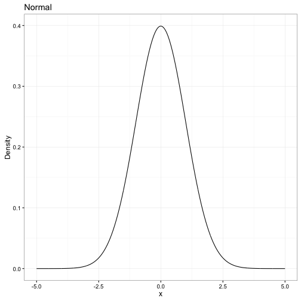
****
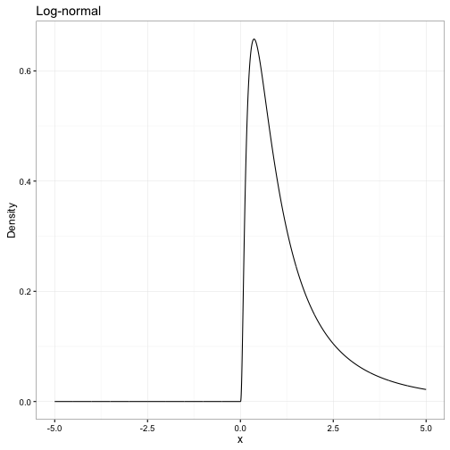

Some statistical background: Joint densities
========================================================
class: small-code


Some statistical background: Joint densities
========================================================
class: small-code
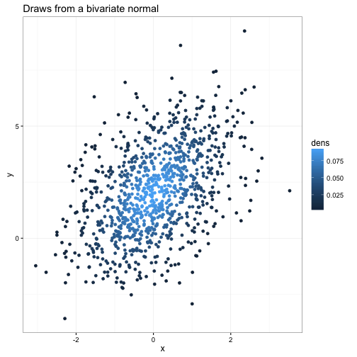


Some statistical background: Marginal distributions
========================================================
class: small-code


Some statistical background: Conditional distribution
========================================================

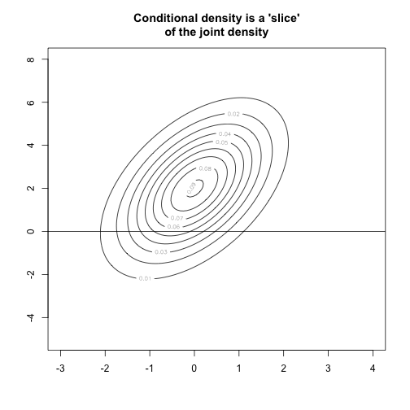


Some statistical background: Density
========================================================
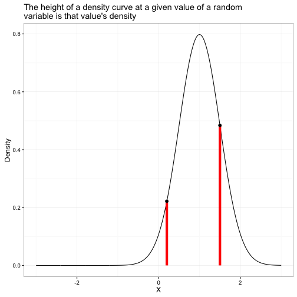


Some statistical background: Likelihood
========================================================

- For a given density function with fixed parameters, and a fixed
observation of the outcomes $Y$, **Likelihood** is the product of
each data point's density. 
- Because densities are typically small, taking logs of densities 
and summing is prefered in many cases. In this case we have the 
**Log Likelihood**. 

Some statistical background: Likelihood
========================================================

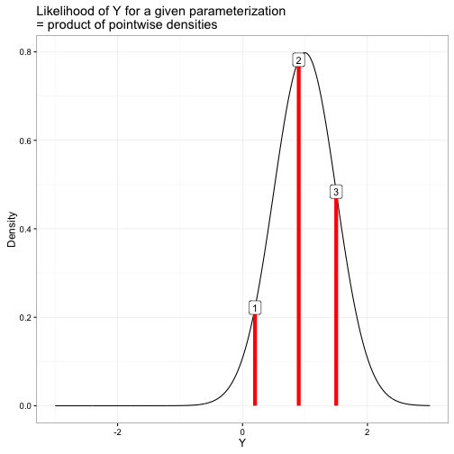


Generative models: Bayes rule
========================================================

Let's call our collection of parameters $\theta$ and our observed heights $y$. 
Bayes rule tells us that 

$$
p(\theta|\, y) = \frac{p(y|\, \theta)\, p(\theta)}{p(y)}
$$

Since $p(y)$ does not depend on $\theta$, we can re-write this in proportional form

$$
p(\theta|y)\propto p(y|\, \theta)\, p(\theta)
$$

Generative models: All we need to do is specify priors and likelihood
========================================================
$$
p(\theta|\, y)\propto p(y|\, \theta)\, p(\theta)
$$

- We have $p(\theta)$---this is what we were using to parameterize the model before. This is called the **prior**
- We have $p(y|\, theta)$---this is the assumed distribution given the parameters. This is the data model for unknown $y$, or the **Likelihood** for fixed $y$. 
- We can use this to estimate our "updated" distribution for the parameters: $p(\theta|\, y)$. This is the **posterior**

Generative models: All we need to do is specify priors and likelihood
========================================================

- If you can form priors for your parameters and come up with a conditional density for your data, Stan will help you estimate the posterior. 
- We can use priors to help us incorporate information not in the data. 


Part 3: Unconfounded models & observed confounders
========================================================

- Causal diagrams
- The experimental ideal. Why do experiments work?
- Thinking about experiments from perspective of Rubin
- Estimating treatment effects with regression
- Incorporating control variables
- Bad controls

Causal diagrams
========================================================

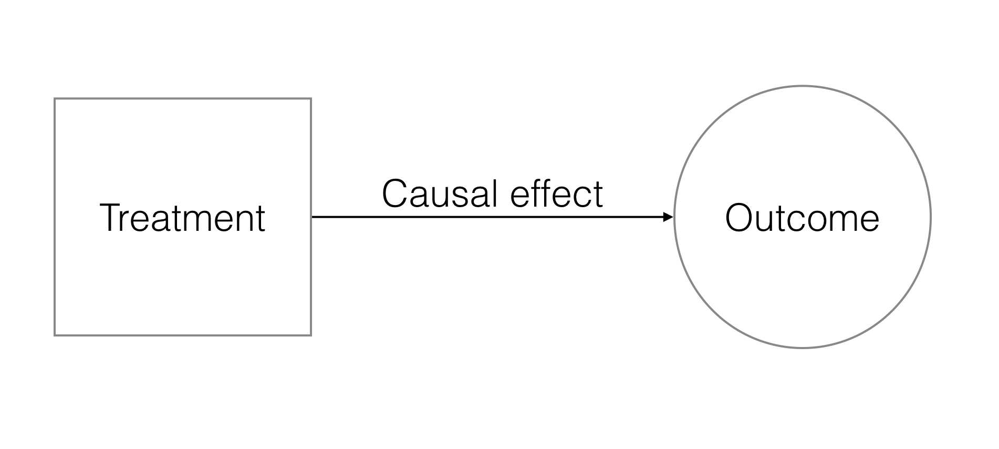

Causal diagrams
========================================================

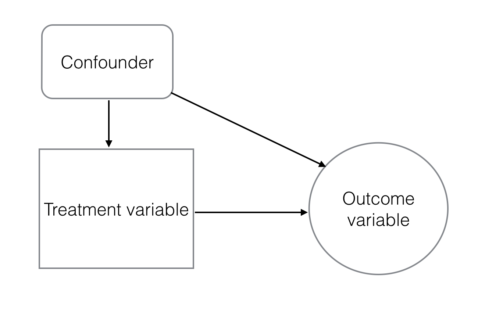


The experimental ideal
========================================================

### Randomised Control Trial

Idea: 
- If we randomly allocate the treatment, unobserved confounders will be equally distributed between treatment and control groups
  - Randomised access to education/presitigious courses
  - Randomised roll-out of aid programs (JPAL)
  - Randomised marketing

A-B testing in practice
========================================================

In commerce, RCTs are called A-B tests

- Have a "treatment" group A, and "control" group B. 
- Units must be randomly allocated across groups (at least random, conditional on their characteristics)
- Observe differences between groups. This is estimate of the **Average Treatment Effect** (ATE)
- Can have multiple groups, so long as they're large enough. 

### Excellent practice

And when you can't do an A-B test? 
========================================================

- Some treatments are very expensive (entry/new products)
- Others are unethical (education/some aid)
  - If some are going to miss out anyway, why not randomise who misses out? 

Example in rstanarm
========================================================

Experiment
- Across three different `replicates` (three patches)
- Divide plants into groups (treatment, control)
- Spray plants with a given `dose` of herbicide
- Watch to see if the plants die

Example in rstanarm
========================================================
class: small-code


```r
library(rstanarm); library(readr)
setwd("Whereever/you/have/downloaded/class/files")

plant_data <- read_csv("herbicide.csv")
# Run logistic regression
mod <- stan_glm(died ~ dose, family = binomial, data = plant_data, cores = 4)
summary(mod)
```

Regression with controls
========================================================


Regression with controls
========================================================

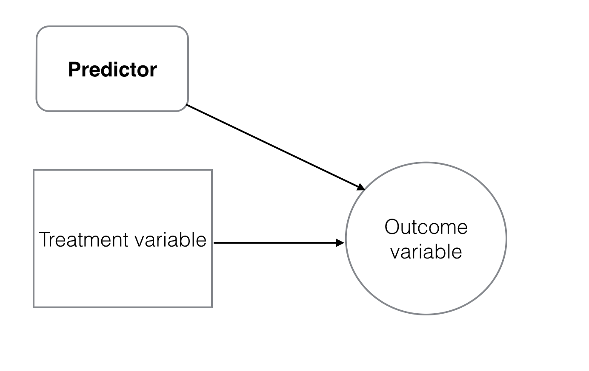

Bad controls
========================================================

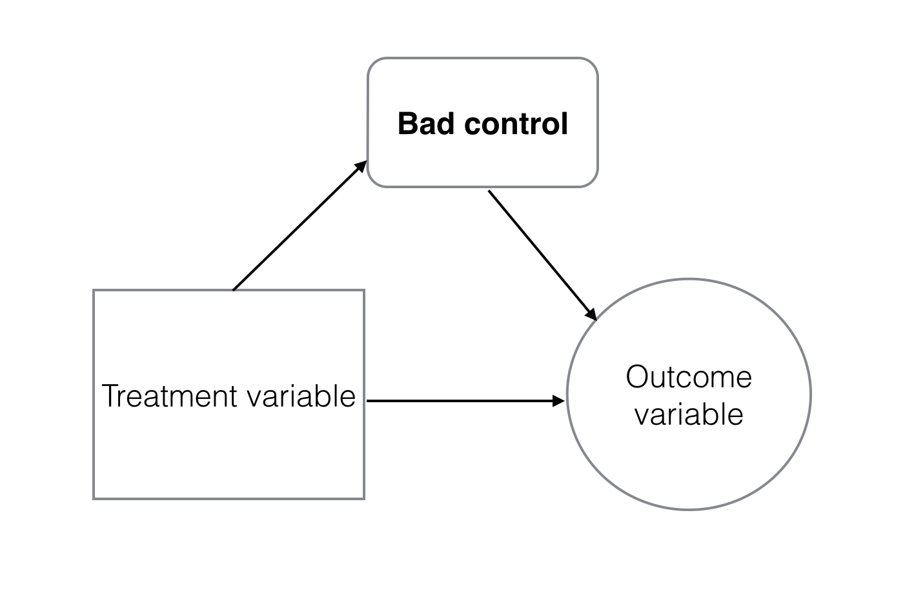


The rule
========================================================

- Run regression 
  - LHS = your dependent variable
  - RHS = your treatment + confounders
  - **Make sure there are no bad controls**
  - Include predictors? Sometimes, but shouldn't make a large impact. 


Session 4
========================================================

What is panel data?
========================================================

- Multiple observations, multiple units
  - Observe many customers over many periods
  - May have to use week 1's skills to put it in this form!
  

|Individual | Time| Purchases| Letters|Gender | Postcode| Age|
|:----------|----:|---------:|-------:|:------|--------:|---:|
|Nilay      | 2012|        50|       3|F      |     3057|  34|
|Nilay      | 2013|        76|       7|F      |     3057|  35|
|Nilay      | 2014|        33|       2|F      |     3057|  36|
|Lulu       | 2012|        12|       2|F      |     3053|  19|
|Lulu       | 2013|        32|       4|F      |     3053|  20|
|Lulu       | 2014|         0|       3|F      |     3053|  21|


Why is panel data important? 
========================================================
class: small-code
- What is the causal issue in:

```
model <- lm(purchases ~ Letters + Gender + factor(Postcode) + Age, data = mypanel)
```


Why is panel data important? 
========================================================
class: small-code
- What is the causal issue in:

```
model <- lm(purchases ~ Letters + Gender + factor(Postcode) + Age, data = mypanel)
```
- Unobserved confounders: past managers/marketers may have targeted Nilay more, but that doesn't mean that the marketing *caused* her higher purchases. 
  - Maybe she was more likely to both receive marketing *and* make purchases?
  - Example from Facebook marketing uplift estimates
  
  
Individual-level "effects"
========================================================

- If we "de-mean" each individual, **we have removed the effect of all unobserved information at the individual level that does not vary over time**. 
  - "de-meaning" is the process of subtracting the average value of the dependent variable for each individual.
  - In the example above, we'd be interested in how an above-average marketing effort would affect Nilay's purchases relative to her average, and Lulu's relative to her average, etc. 
  - This is automated. No need to "de-mean" the data yourself. 
  
  
Introducing the mixed effects model
========================================================

- Mixed effects models make it very easy to pull out individual "effects"
  - Terminology: "effects" are the individual characteristics we never see
 
In a linear model, we have 

\[
y_{i} = \beta_{0} + \beta_{1}x_{1, i} + \beta_{2}x_{2, i} +... + \epsilon_{i}
\]

A panel model has two subscripts: one for the individual $i$, and one for the time, $t$. We can express a model with individual intercepts as

\[
y_{i,t} = \beta_{0,i} + \beta_{1}x_{1, it} + \beta_{2}x_{2, it} +... + \epsilon_{it}
\]


Introducing the mixed effects model
========================================================


Introducing the mixed effects model
========================================================


***install.packages(c("lme4", "arm"))***


Implementing the varying-intercepts model in R
========================================================
class: small-code
- We want to estimate the parameter $\beta_1$ in 
\[
\mbox{PostTest}_i = \beta_0 + \beta_1 \mbox{treatment}_{i} + \beta \mbox{controls}_{i} + \epsilon_{i}
\]


```r
library(rstanarm)

mod2 <- stan_lmer(PostTest ~ Treatment + PreTest + (1 | Grade), data = Electric_company)
#summary(mod2)
```

Note the syntax: All the same, except for the `(1 | Grade)`. 

- The `1` means that we want varying intercepts
- The `| Grade ` says that we want varying intercepts for each grade. 

Implementing the varying-intercepts model in R
========================================================
class: small-code
### We can also have varying treatment effects

**Use the superannuation data**


Relationship to difference-in-differences
========================================================


Session 5
========================================================


Natural experiments: a primer
========================================================

Sometimes we don't need to run an experiment. One exists in our observational data. 

- Arbitrary shifts in policy
  - MySuper and super fees
- Unanticipated weather shifts/plagues/lotteries
  - Fish in NY, draft lottery
- Strikes/abrupt changes in input costs
  - Unemployment diaries in Australia
  - Changes in commodity prices

A good natural experiment
========================================================

- Does a reasonable job at predicting differences in the treatment
- Satisfies the "exclusion restriction"
  - Why is it called the exclusion restriction? 

A good natural experiment
========================================================

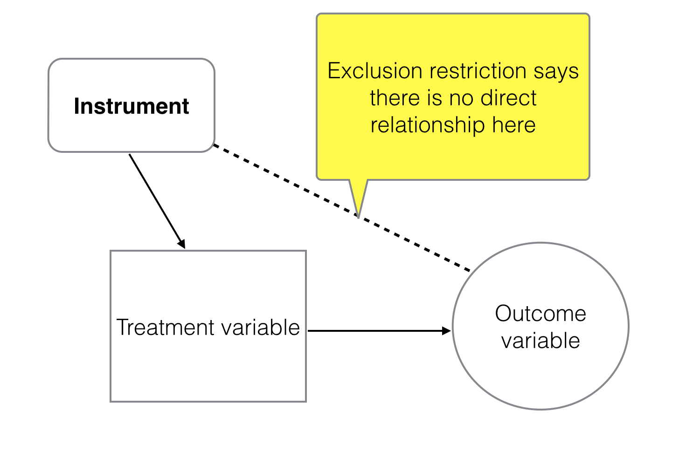

2-stage least squares
========================================================
Idea

- Predict treatment given control variables and instruments
- Use predicted treatment in regression (with controls)

2-stage least squares example
========================================================


```r
library(dplyr); library(AER)
data("CigarettesSW")

CigarettesSW <- CigarettesSW %>%
  mutate(rprice = price/cpi, # Real price adjusted for inflation
         rincome = income/population/cpi, # Real per-capital income
         tdiff = (taxs - tax)/cpi)
```


2-stage least squares example
========================================================

### ivreg syntax

`dependent_variable ~ endogenous_var + confounders | confounders + instruments`

2-stage least squares example
========================================================


```r
# Simple bivariate regression
model1 <- lm(log(packs) ~ log(rprice), data = CigarettesSW)

# Regression with controls
model12 <- lm(log(packs) ~ log(rprice) + log(income) + year, data = CigarettesSW)

model2 <- ivreg(log(packs) ~ log(rprice) + log(rincome) + year | log(rincome) + tdiff + I(tax/cpi), data = CigarettesSW)
```


Going over estimating the causal impact if you can run an experiment
========================================================
class: small-code
- We can run linear regression: 

\[
\mbox{outcome}_{i} = \beta_{0} + \beta_{1}\mbox{treament}_{i} + \beta\mbox{controls} + \epsilon_{i}
\]

```
model <- lm(outcome ~ treatment + control1 + etc, data = mydata)
```

And the "causal effect" of the treatment on our outcome is the estimate of $\beta_1$


Going over estimating the causal impact if you can run an experiment
========================================================
class: small-code
### Example

```
library(arm)
data(lalonde)


model <- lm(outcome ~ treatment + controls, data = lalonde)

#summary(model)
```


Going over Instrumental Variables again
========================================================

- It is an attempt to find a "natural experiment" in our treatment
- Or an attempt to properly consider the "experiment"
  - Intent to treat
- Idea is to replace **treatment** in our regression with an estimate of the **random component of treatment**.
  - 2SLS: First regression is `treatment ~ instrument + controls`
  - Second regression is `outcome ~ predicted_treatment_from_first_stage + controls`
- We use `ARM::ivreg`


The problem with IV
========================================================

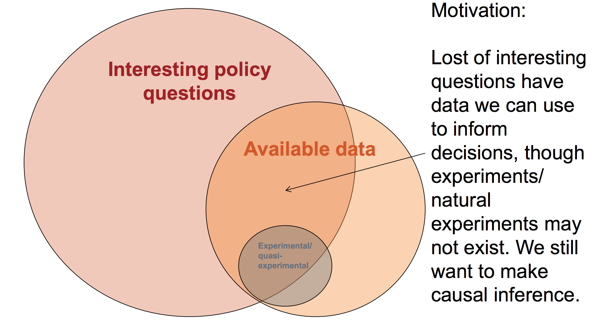

I want to know more
========================================================

### Read this book
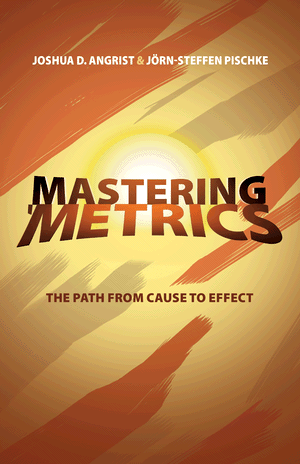


Introducing propensity score matching
========================================================

- Why does an experiment work? 
  - The distribution of counfounders---both measured and unmeasured---is equal across treatment and control. 

If we don't have a natural experiment or panel data, then perhaps it is least bad to build a **synthetic control group**. This will mean that our control group and treatment group are similar **on observed confounders**. 

Incomplete overlap
========================================================

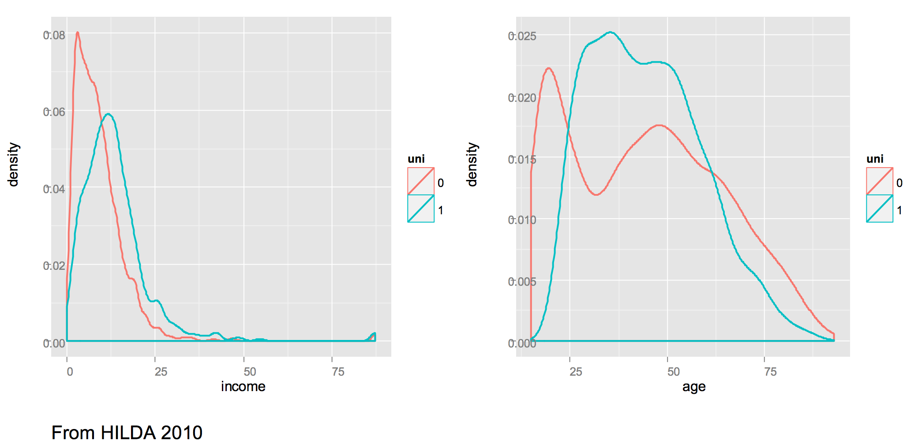

So how do we create a matched control? 
========================================================

### "Exact matching" or "complete matching"

- Match each graduate man with a non-graduate man
  - Match each 25 year old graduate man with a 25 year old non-graduate man
      - Match each 25 year old graduate Asian man with a 25 year old non-graduate Asian man
          - ...
- Upside is that you get great balance
- Downside is that you can't match on many confounders. You encounter a "dimensionality problem"


So how do we create a matched control? 
========================================================

### Clustering

- Perform K-nearest-neighbours or some other clustering routine to group together similar people. 
- Estimate "treatment effects" within each cluster

- Good thing is that you'll end up with a fairly balanced control group
- Bad thing is that you will balance on variables that may not matter


We need to "reduce the dimensions"
========================================================

- Difficult to match on many dimensions
- Easy to match on one dimension
- What if we can create a "score" of how similar two people are in terms of their likelihood to get a treatment, based on their characteristics? 
  - If we have a score, we can match on that. 
- We'll call this a **propensity score**. 


Tends to make better control groups
========================================================

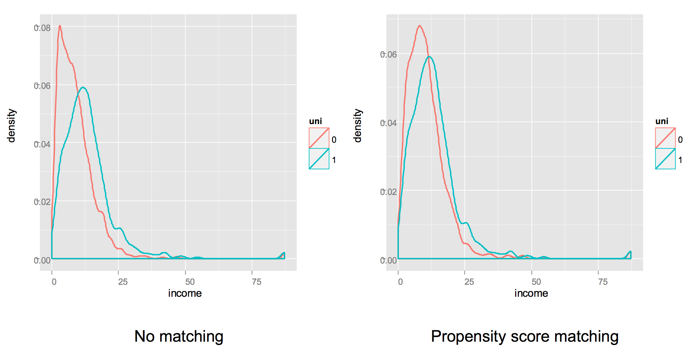


Tends to make better control groups
========================================================
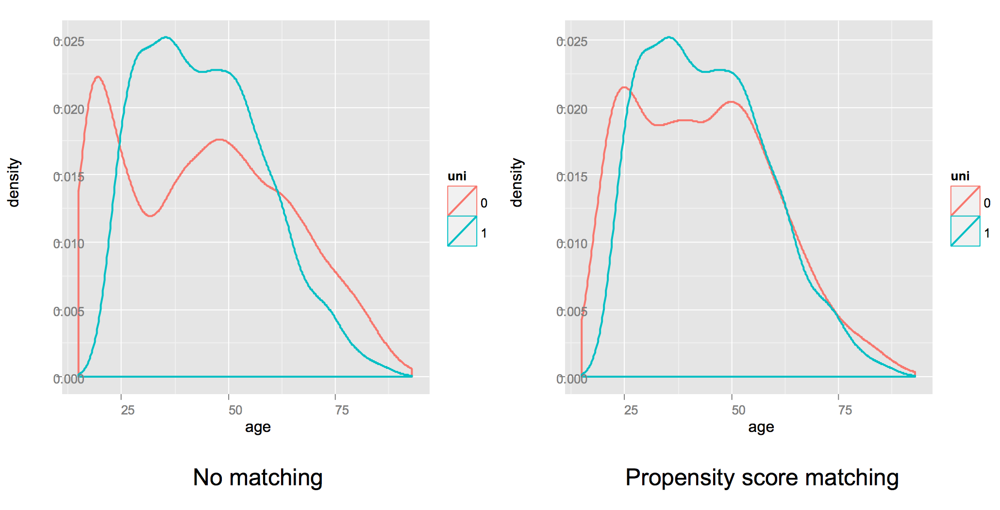


Method
========================================================

1. Build a model that predicts whether someone received the treatment given their (observed) individual characteristics. 
  - The predicted values of this model are the **propensity scores**. 
2. For those **who did** receive the treatment, choose one or many people **who did not** receive the treatment but has a similar propensity score. 
  - Can use many different matching routines (nearest match, "calliper" matching, etc.)
3. Discard unmatched observations
4. Run a regression model on the remainder (treatment + synthetic control)


Does the model estimate the causal effect?
========================================================

### Maybe
- The main assumption is that after controlling for the observed confounders, treatment is as good as random. 
  - Rules out big unobserved confounders. 
- In practice, we include observed covariates because we hope they are correlated with the unobserved ones. 

Does the model estimate the causal effect?
========================================================

### Critiques
- The Smith-Todd critique: If your model of treatment is not **robust** (changes a lot if you include/exclude covariates), your causal estimate will not be robust. 
  - Use regularised GLM for feature selection! 
- Miller Savage Tan critique: Two very different people can have a similar propensity score, and so propensity score matching does not efficiently balance treatment and control groups. 
  - We can use proximity scores from a Random Forest for better matching; has the strengths of exact matching *and* propensity score matching. 


Implementing propensity score matching in R
========================================================
class: small-code

```r
library(arm)
data("lalonde")

# First model: Predict treatment given demographic characteristics
propensity_model <- glm(treat ~ age + I(age^2) + educ + black + hisp + married + nodegr, 
                        data = lalonde, 
                        family = binomial(link = "logit"))

# Get the propensity scores
lalonde$propensity_score <- predict(propensity_model, type = "response")

# Generate matches
matches <- matching(z = lalonde$treat, score = lalonde$propensity_score)

# Subset the data
lalonde_matched <- lalonde[matches$matched,]
```


Implementing propensity score matching in R
========================================================


```r
# Run the two models
# Unmatched data
model_unmatched <- lm(re78 ~ treat + . - propensity_score, data = lalonde)
# Matched data
model_matched <- lm(re78 ~ treat + . - propensity_score, data = lalonde_matched)

# What was the original estimate of the treatment effect?
summary(model_unmatched)
# Has it changed? 
summary(model_matched)
```


You should go and learn my method! 
========================================================

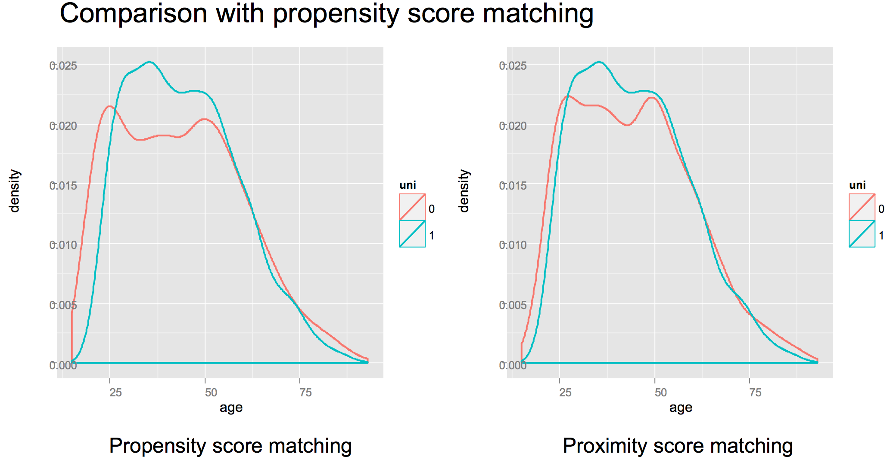

BART and treatment effects
========================================================
