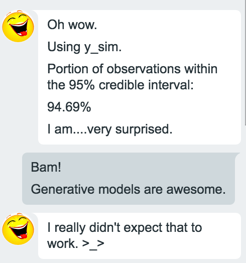
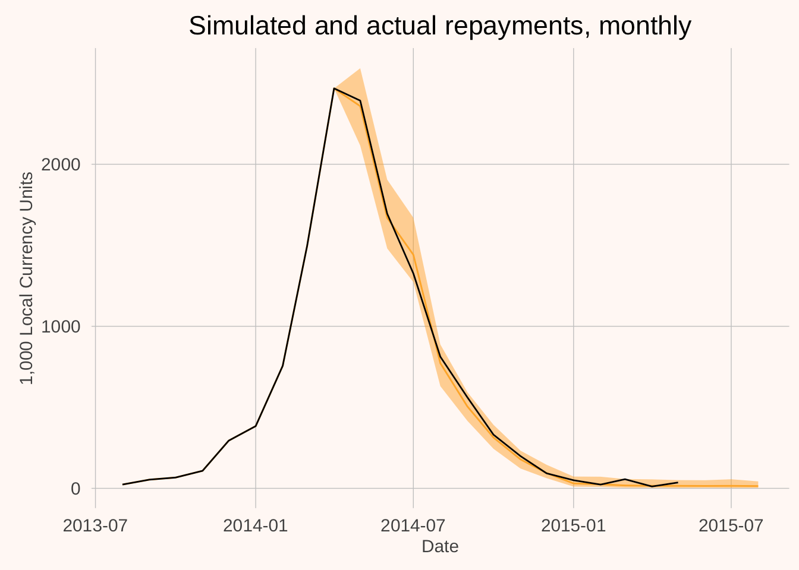
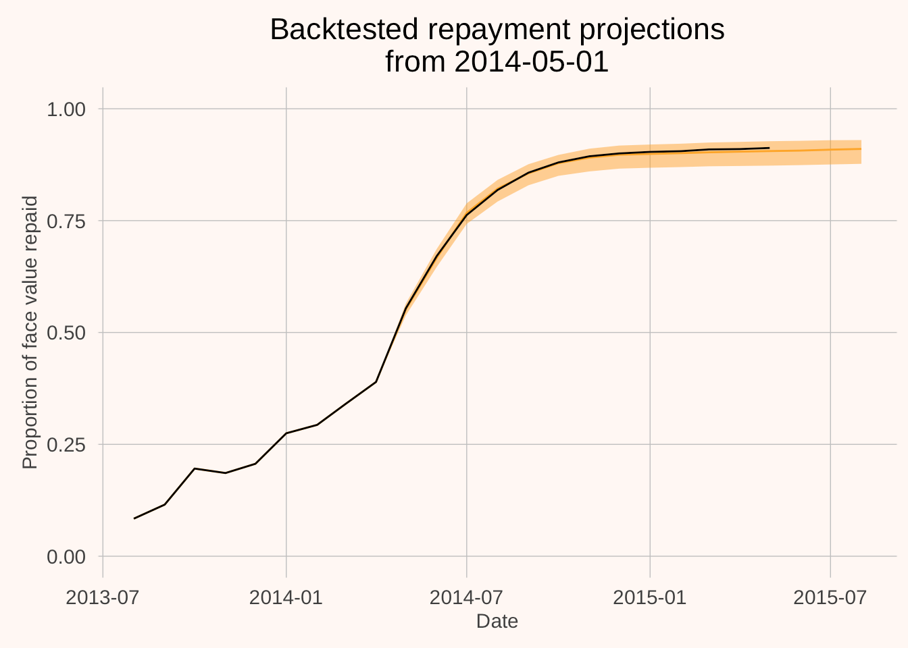
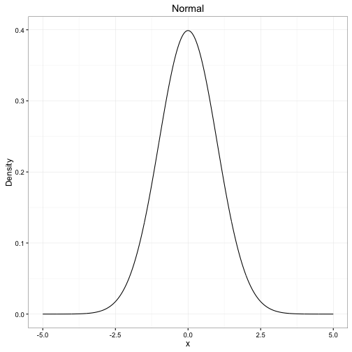
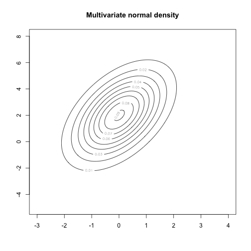
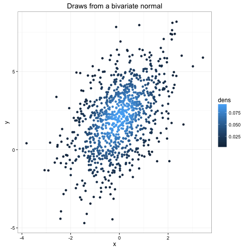
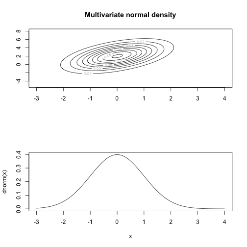
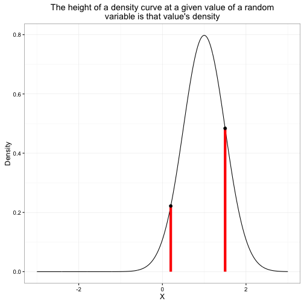
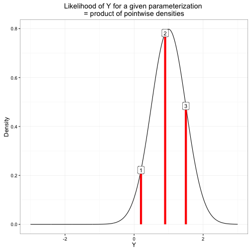
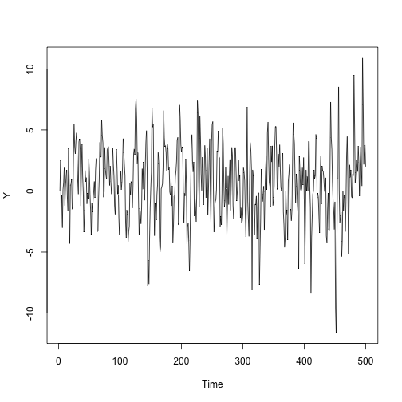

<style type="text/css">
.small-code pre code {
font-size: 0.9em;
}
.footer {
    color: black; background: #E8E8E8;
    position: fixed; top: 90%;
    text-align:center; width:100%;
}
</style>

Modern Statistical Workflow in Stan
========================================================
author: Jim Savage
date: 26 May, 2016
autosize: true


Can't make it? Play along at home
========================================================

All code for tonight is on my Github: 

```
www.github.com/khakieconomics/MSW

git clone git@github.com:khakieconomics/MSW.git
```


Modern Statistical Workflow: why? 
========================================================

- As the amount of data that we're able to process grows, 
we can estimate more complex models. 
- More complex models can give us better insights,
- But also be far more likely to break. 
- Need a workflow that helps us develop high quality models that don't break. 

Modern Statistical Workflow: the punchline
========================================================

1. Write out the probability model (priors and likelihood)
2. Simulate from the model with known parameters
3. Estimate your model to make sure you can recapture the parameters
4. Estimate the model on real data
5. Check the model fit to make sure it estimated properly. (You will be amazed at how many of the models that you are using today haven't!)
6. (If you have more than one model) model comparison
7. Inference
8. Iterate! 


Outline
========================================================

- Modern Statistical Workflow (done!)
- A very gentle introduction to generative models
- Modern Statistical Workflow example 1: AR model
- Modern Statistical Workflow example 2: TVP-AR model


Generative models: what are they?
========================================================
**Technical**

A joint distribution of all the unknowns in the model. Unknowns = outcomes, parameters, latent variables. 

**Street**

A model in which we deal coherently with both uncertainty in the dependent variables and all the parameters of the model. 

Generative models: Why?
========================================================


****
- We care about uncertainty
- We don't just care about correct classification
- Want to know how probable we think various outcomes are
- Interested in quantiles
- Interested in the values of parameters
- Interested in constructs of the values of parameters
- ...


Generative models: You can build kick-arse models
========================================================

- Train model on **150** rural microfinance loans in Kenya
- Predicted the repayments of 2000 different rural microfinance loans over a period of 9 months
- Cumulative error = less than 1 per cent. 


Generative models: You can build kick-arse models
========================================================




Generative models: You can build kick-arse models
========================================================




Generative models: Why not?
========================================================

**"Bayesian inference is hard in the sense that thinking is hard" - Don Berry**

- No black box solutions
- Actually have to *know* the model that you are estimating
- A lot is not automated. 
- Historically quite difficult. 

But now we just use **Stan**. 


Generative models: human heights
========================================================

Let's say we want a model of human heights using only sex to predict. I want to build a model that can help answer several questions: 

- If I know that someone is female, what do I predict their height to be on average? 
- If I don't know what sex someone is, what do I predict their height to be?
- How uncertain am I about the average height of men? 
- How tall do I expect a man at the 90th percentile of height to be? 


Generative models: Parts of the model
========================================================

- **Explanatory variable**: sex (also known as feature, covariance, auxiliary variable, etc.). Explanatory variables are known with certainty, both in and out of sample. 
- **Outcome**: height (also known as response, dependent variable, etc.). Given the explanatory variable, many possible values of outcome are possible. We treat it as a random variable. 

Generative models: Parts of the model
========================================================

- **Distribution**. We need to make (informed) assumptions about how the outcome is distributed given the explanatory variables. For this purpose, let's let

$\mbox{female height} \sim \mbox{normal}(\mbox{average}_{f}, \sigma)$ and

$\mbox{male height} \sim \mbox{normal}(\mbox{average}_{m}, \sigma)$ (same standard deviation)

- **Parameters** Values that map our explanatory variables to our outcome via the distribution(s). In this case, the *mean height of men*, the *mean height of women*, the *standard deviation of people*, and the *sex shares* will be sufficient. 


Generative models: drawing inference from model output
========================================================
class: small-code
- Let's **simulate** this model with known parameters. 


```r
library(dplyr)
# Random draws of height for 10k people from normal distribution
# 51% female
heights_women <- rnorm(n = 5100, mean = 165, sd = 8)
# 49% male
heights_men <- rnorm(n = 4900, mean = 175, sd = 8)
# Organize the data into a data.frame
heights_people <- data_frame(Sex = c(rep("f", 5100), rep("m", 4900)),
                             height = c(heights_women, heights_men))
```

- This is called Monte Carlo sampling. Given enough draws from a distribution, we can calculate any statistic to an arbitrary degree of accuracy. 


Generative models: drawing inference from model output
========================================================
class: small-code

```r
# Female height on average
heights_people %>% 
  filter(Sex=="f") %>%
  summarize(mean(height))
```

```
Source: local data frame [1 x 1]

  mean(height)
         (dbl)
1     165.0556
```

```r
# Human height on average
heights_people %>%
  summarize(mean(height))
```

```
Source: local data frame [1 x 1]

  mean(height)
         (dbl)
1      170.024
```


Generative models: drawing inference from model output
========================================================
class: small-code

```r
# Standard deviation of height of men
heights_people %>%
  filter(Sex=="m") %>%
  summarize(sd(height))
```

```
Source: local data frame [1 x 1]

  sd(height)
       (dbl)
1   8.013652
```

```r
# Height of males at the 90th percentile
heights_people %>%
  filter(Sex=="m") %>%
  summarize(quantile(height, 0.9))
```

```
Source: local data frame [1 x 1]

  quantile(height, 0.9)
                  (dbl)
1              185.3375
```


Generative models: What is wrong with this model?
========================================================

**Do you believe this model?**

Generative models: What is wrong with this model?
========================================================

- No uncertainty in parameters
- Have not used any data! 
- The the distributional assumptions valid? 

We want to spend some time working through these problems. 


Some statistical background: random variables
========================================================

A variable is a **random variable** if its value is not 
controlled/deterministic. It is subject to chance. 

We think about the following as random variables: 

- Outcomes
- Parameters
- Latent Variables


Some statistical background: Probability density functions
========================================================

A probability density function tells us the relative probability
of observing certain values of a random variable. 

- We denote the density of random variable $X$ with $p(X)$
- $p()$ is *overloaded*, meaning $p(X)$ could have a different form to $p(Y)$
- The area under the curve $p(X)$ is 1


Some statistical background: Probability density functions
========================================================
class: small-code


****


Some statistical background: Joint densities
========================================================
class: small-code


Some statistical background: Joint densities
========================================================
class: small-code



Some statistical background: Marginal distributions
========================================================
class: small-code



Some statistical background: Conditional distribution
========================================================


Some statistical background: Density
========================================================



Some statistical background: Likelihood
========================================================

- For a given density function with fixed parameters, and a fixed
observation of the outcomes $Y$, **Likelihood** is the product of
each data point's density. 
- Because densities are typically small, taking logs of densities 
and summing is prefered in many cases. In this case we have the 
**Log Likelihood**. 

Some statistical background: Likelihood
========================================================




Generative models: Introducing uncertainty to our model
========================================================

Our model has several random variables: 

1. The average heights of men and women
2. The standard deviation of heights (assume same for all people)
3. The distribution of sexes. 
4. The outcome: The distribution of heights given gender and parameters. 

A more complete generative model is the **joint density** of these

$$
p(\mbox{Heights}, \mbox{average}_{m}, \mbox{average}_{f},\sigma,\mbox{distribution of sexes})
$$


Generative models: Introducing uncertainty to our model
========================================================

This factors into **conditional densities**
$$
p(\mbox{Heights}, \mbox{average}_{m}, \mbox{average}_{f},\sigma, \mbox{distribution of sexes})
$$

$$
= p(\mbox{Heights}|\, \mbox{average}_{m}, \mbox{average}_{f},\sigma, \mbox{distribution of sexes})\times
$$
$$
p(\mbox{average}_{m}|\, \mbox{average}_{f}, \sigma,\mbox{distribution of sexes})\times
$$
$$
p(\mbox{average}_{f}|\, \sigma,\mbox{distribution of sexes})\times
$$
$$
p(\sigma|\,\mbox{distribution of sexes})\times
$$
$$
p(\mbox{distribution of sexes})
$$

And if these are independent
$$
= p(\mbox{Hghts}|\mbox{params})\times p(\mbox{av}_{m})\times p(\mbox{av}_{f})\times p(\sigma)\times p(\mbox{sex distr.})
$$


Generative models: Incorporating uncertainty
========================================================

- Before, we simulated from $p(\mbox{Heights}|\mbox{params})$ taking params to be known
- Now we want to generate draws from the joint density on the previous slide. 

The process is simple: 
- Specify distributions that make sense to you given your expertise for $p(\mbox{av}_{m}, \mbox{av}_{f}, \sigma, \mbox{sex distr.})$
- Assuming independence $p(\mbox{av}_{m})$, $p(\mbox{av}_{f})$, $p(\sigma)$, and $p(\mbox{sex distr.})$. 

Then

1. Draw $\mbox{params}$ from these distributions
2. Parameterize the data distribution with these draws
3. Draw $\mbox{Heights}$ from the newly parameterized $p(\mbox{Hghts}|\mbox{params})$


Generative models: Still haven't used any data!
========================================================

- Note that we are currently using 
$p(\mbox{av}_{m}, \mbox{av}_{f}, \sigma, \mbox{sex distr.})$ 
without having seen any data. 
- Want to condition our parameter estimates on some observed data: 
observed heights and observed sexes. That is, we want
$p(\mbox{av}_{m}, \mbox{av}_{f}, \sigma, \mbox{sex distr.}|\, \mbox{observed heights, sexes})$ 


Generative models: Bayes rule
========================================================

Let's call our collection of parameters $\theta$ and our observed heights $y$. 
Bayes rule tells us that 

$$
p(\theta|\, y) = \frac{p(y|\, \theta)\, p(\theta)}{p(y)}
$$

Since $p(y)$ does not depend on $\theta$, we can re-write this in proportional form

$$
p(\theta|y)\propto p(y|\, \theta)\, p(\theta)
$$

Generative models: All we need to do is specify priors and likelihood
========================================================
$$
p(\theta|\, y)\propto p(y|\, \theta)\, p(\theta)
$$

- We have $p(\theta)$---this is what we were using to parameterize the model before. This is called the **prior**
- We have $p(y|\, theta)$---this is the assumed distribution given the parameters. This is the data model for unknown $y$, or the **Likelihood** for fixed $y$. 
- We can use this to estimate our "updated" distribution for the parameters: $p(\theta|\, y)$. This is the **posterior**

Generative models: All we need to do is specify priors and likelihood
========================================================

- If you can form priors for your parameters and come up with a conditional density for your data, Stan will help you estimate the posterior. 
- We can use priors to help us incorporate information not in the data. 

The Autoregressive model
========================================================

And AR(P) model is

$$
y_{t} = \alpha + \beta_{1}y_{t-1} + \dots + \beta_{P}y_{t-P} + \epsilon_{t}
$$

with $\epsilon$ iid. We should specify a density fo $\epsilon$

The Autoregressive model
========================================================
class: small-code
### Simulating the model in R


```r
intercept <- 0.5
beta_1 <- 0.6
beta_2 <- -0.2
sigma <- 2
nu <- 4
T <- 500

epsilon <- sigma*rt(n = T, df = nu)
Y <- rep(NA, T)
Y[1:2] <- 0

for(t in 3:T) {
  Y[t] <- intercept + beta_1 * Y[t-1] + beta_2 * Y[t-2] + epsilon[t]
}
```


The Autoregressive model
========================================================




Quick outline of a Stan model
========================================================

- `data`: declare the data you will give the model
- `transformed data`: make any changes to the data
- `parameters`: declare the unknowns
- `transformed parameters`: sometimes the parameters we want are a function of pars. that are easy to estimate
- `model`: declare the priors and likelihood

Syntax is somewhere between R and C++:

- R-like loops, very similar indexing
- C++-like static typing, commenting, finish lines with ;


The Autoregressive model
========================================================
### Estimating the model in Stan

- Write out the Stan model (see `model_1.stan` in github folder)
- load `library(rstan)`
- Use


```r
library(rstan)
options(mc.cores = parallel::detectCores())
fit <- stan(file = "model_1.stan", data = list(T = T, Y = Y))
print(fit, pars = c("intercept", "beta_1", "beta_2", "sigma"))
```


Checking model fit
========================================================


```r
install.packages("shinystan")
shinystan::launch_shinystan(fit)
```

The Autoregressive model
========================================================

- What is wrong with the model above? Are errors normally distributed in the data generating model?


```r
library(rstan)
options(mc.cores = parallel::detectCores())
fit_2 <- stan(file = "model_2.stan", data = list(T = T, Y = Y))
print(fit_2, pars = c("intercept", "beta_1", "beta_2", "sigma", "nu"))
shinystan::launch_shinystan(fit_2)
```

Comparing models
========================================================

We can compare models using the `loo` package


```r
install.packages("loo")
library(loo)
ll_1 <- loo(extract_log_lik(fit, parameter_name = "log_density"))
ll_2 <- loo(extract_log_lik(fit_2, parameter_name = "log_density"))

compare(ll_1, ll_2)
```


TVP-AR model
========================================================

Time-varying parameter models allow us to incorporate some changes in the parameter vector over time. For instance, we may want to model the fact that relationships change over time, or not let previous regimes affect our current estimates too greatly. 

A TVP AR(1) model might take the form

$$
y_{t} = \alpha_{t} + \beta_{1, t} y_{t-1} + \epsilon_{t}
$$

with $\alpha_{t} \sim \mbox{normal}(\alpha_{t-1}, \sigma_{\alpha})$ and $\beta_{t} \sim \mbox{normal}(\beta_{t-1}, \sigma_{\beta})$. We could model the innovations $\epsilon_{t}$ as we did before. 


TVP-AR model
========================================================

In Stan, we simply write out the model as we write it out here. Though we could estimate $\sigma_{\alpha, \beta}$, this makes the model a bit more difficult to run. Easier to provide those parameter (how much do you want your parameters to update each period?)


```r
load("quarterly_data.RData")
CPI <- dat1[,2]

library(rstan)
options(mc.cores = parallel::detectCores())
tvp_mod <- stan("tvp_ar1.stan", data = list(T = length(CPI), Y = CPI, 
                                            sigma_intercept = 0.1, sigma_beta = 0.02))

shinystan::launch_shinystan(tvp_mod)
```
